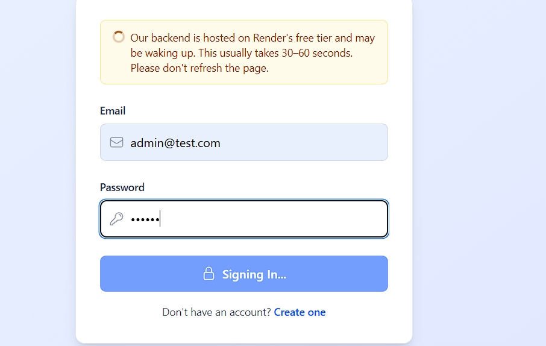
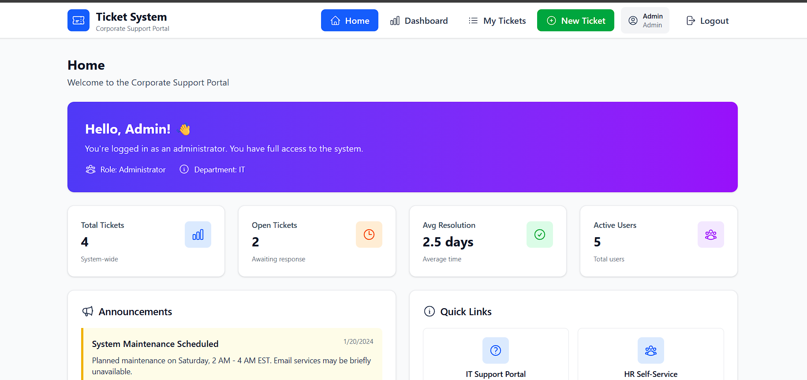
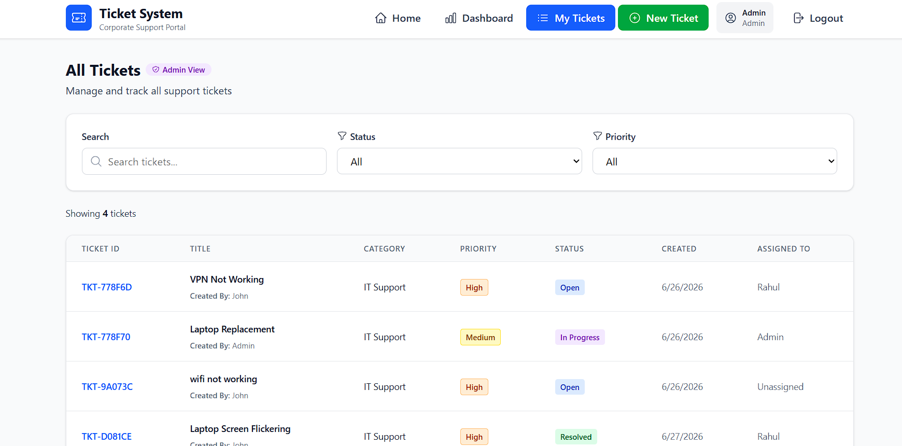
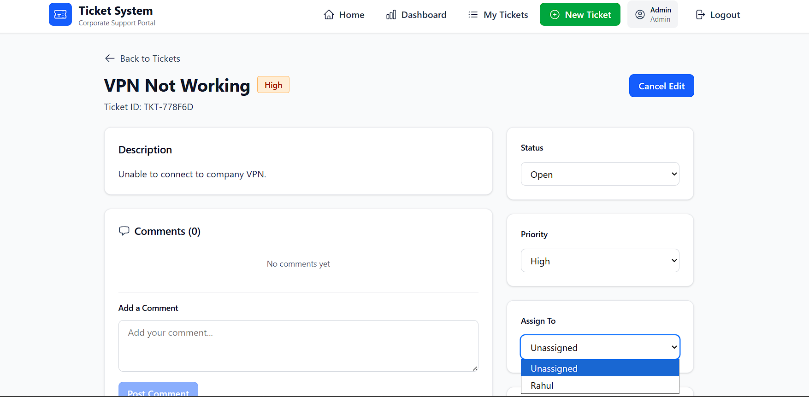

# 🎫 TicketFlow – Help Desk Ticket Management System

A full-stack Help Desk Ticket Management System that enables employees to raise support requests, allows support agents to resolve assigned tickets, and provides administrators with complete control over ticket management.

Built with the MERN stack using React, Express.js, MongoDB, and JWT Authentication.

---

## 🚀 Live Demo

https://ticket-flow-three-phi.vercel.app/

---

# 📸 Screenshots

## Login Page
# 📸 Screenshots

## Login Page



> Secure JWT authentication with loading indicator while the Render backend wakes up.

---

## Admin Dashboard



> Dashboard displaying ticket statistics, announcements, quick links, and administrator overview.

---

## Ticket Management



> Search, filter, assign, and manage support tickets with role-based access control.

---

## Ticket Details



> Update ticket status, assign support agents, and manage comments from a single interface.

## 🛠 Tech Stack

### Frontend
- React 19
- Vite
- Tailwind CSS
- Heroicons
- Axios

### Backend
- Node.js
- Express.js
- MongoDB
- Mongoose
- JWT Authentication
- bcrypt

### Deployment
- Frontend: Vercel
- Backend: Render
- Database: MongoDB Atlas

---

## 📂 Project Structure

```
TicketFlow
│
├── client
│   ├── public
│   ├── src
│   │   ├── api
│   │   ├── assets
│   │   ├── components
│   │   ├── services
│   │   ├── utils
│   │   ├── App.jsx
│   │   └── main.jsx
│   ├── package.json
│   └── vite.config.js
│
├── server
│   ├── config
│   ├── controllers
│   ├── middleware
│   ├── models
│   ├── routes
│   ├── utils
│   ├── validators
│   ├── package.json
│   └── server.js
│
├── README.md
└── .gitignore
```

---

## ⚙️ Installation

### Clone Repository

```bash
git clone https://github.com/yourusername/ticketflow.git

cd ticketflow
```

### Backend Setup

```bash
cd server
npm install
```

Create `.env`

```env
PORT=5000
MONGO_URI=your_mongodb_connection_string
JWT_SECRET=your_secret_key
```

Run Backend

```bash
npm run dev
```

---

### Frontend Setup

```bash
cd client
npm install
```

Create `.env`

```env
VITE_API_URL=http://localhost:5000
```

Run Frontend

```bash
npm run dev
```

---

## 🔐 User Roles

| Role | Permissions |
|------|-------------|
| Employee | Create, edit, and track personal tickets |
| Support Agent | View assigned tickets and update status |
| Admin | View all tickets, assign tickets, manage users |

---

## 📌 API Endpoints

### Authentication

```
POST /api/auth/register
POST /api/auth/login
GET  /api/auth/profile
```

### Tickets

```
GET    /api/tickets
POST   /api/tickets
PUT    /api/tickets/:id
PUT    /api/tickets/:id/assign
POST   /api/tickets/:id/comments
```

### Users

```
GET /api/users/support-agents
```

---

## ✨ Key Features

- JWT Authentication
- Protected APIs
- Role-Based Access Control
- Responsive UI
- Ticket Assignment
- Dashboard Analytics
- Comment System
- Persistent Login
- RESTful API Architecture
- MongoDB Integration

---

## 🔮 Future Improvements

- Email Notifications
- File Attachments
- Search & Advanced Filters
- Ticket Priority Automation
- Admin User Management
- Dark Mode
- Activity Logs
- Real-time Notifications using Socket.io

---

## 👨‍💻 Author

**Shashwat Pathak**

GitHub: https://github.com/ShashwatPathak-01

LinkedIn: https://www.linkedin.com/in/shashwat-pathak-775680255/

---
